I'm Batu Koray Masak, an undergraduate researcher at Koç University and a sophomore at Özyeğin University in Istanbul, double majoring in AI & Data Engineering and Computer Science. I have consistently ranked in the top three of my department throughout university, with a current CGPA of **3.77/4.00**.

 

My main interests are NLP, transformer architectures, trustworthy language models, and LLM security.

